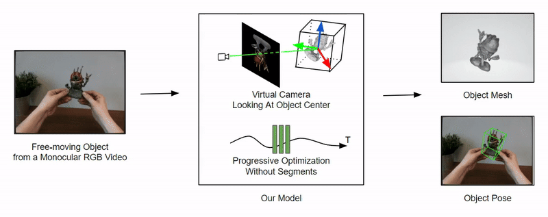

# FMOV
## [Project Page](https://haixinshi.github.io/fmov/) |  [Paper](https://arxiv.org/abs/2405.05858) | [Data](https://drive.google.com/file/d/1BSuuN2BEHnSeWC0vZhCG1E82jD80XJvT/view?usp=sharing) | [Google Colab](https://drive.google.com/file/d/1eGEqkwVpViLWbk4nY2syS8TJ30JIRnZD/view?usp=sharing)
This is the official repo for the implementation of **Free-Moving Object Reconstruction and Pose Estimation with Virtual Camera**.

## Overview
We propose an approach for reconstructing free-moving object from a monocular RGB video without any priors like scene prior, hand pose prior, object category or pose prior, or local optimization with multiple sequence segments. 


<div align="center">
	
</div>


Our method allows free interaction with the object in front of a moving camera, and optimizes the sequence globally **without any segments**. We progressively optimize the object shape and pose simultaneously based on an implicit neural representation. A key aspect of our method is a **virtual camera system** that reduces the search space of the optimization significantly. Please check our [project page](https://haixinshi.github.io/fmov/) for more visualization results.

## Usage

### Environment Setup

#### Conda
```shell
conda create -n fmov python=3.9.17
conda activate fmov
conda install pytorch==1.9.1 -c pytorch
git clone https://github.com/HaixinShi/fmov_pose
cd fmov_pose
pip install -r requirements.txt
# you need find "/path/to/conda/envs/fmov" on your machine
cp ./utils/draw_plotly.py /path/to/conda/envs/fmov/lib/python3.9/site-packages/open3d/visualization/ 
```

#### Docker Image

```shell
docker pull sysonsoar/fmov:1.0
# "-v /path/to/docker_experiment_dir:/fmov/exp" is optional. It is needed if you want to view experiment results from your host machine.
docker run --gpus all -it -v /path/to/docker_experiment_dir:/fmov/exp --ipc=host sysonsoar/fmov:1.0 /bin/bash
# the following commands are entered in docker container
conda activate fmov
cp ./draw_plotly.py /opt/conda/envs/fmov/lib/python3.9/site-packages/open3d/visualization/
```

### Data
Please download preprocessed HO3Dv3 and ML datasets from [data.rar](https://drive.google.com/file/d/1BSuuN2BEHnSeWC0vZhCG1E82jD80XJvT/view?usp=sharing) and then extract and put it to a sub-folder named `data` of the repository root. For the provided example datasets, we alread use [LoFTR](https://github.com/zju3dv/LoFTR) to get the semi-parse matches among nearby image frames in each video; besides, we use [SAM](https://github.com/facebookresearch/segment-anything) and [XMem](https://github.com/hkchengrex/XMem) to get object masks. For sequence with suffix "_ori", we already applied virtual camera mechanism to preprocess it. If you are interested about it, please refer the 2nd section as follows. 

#### Data Format
The data is organized as follows:

```
fmov_pose
|-- data
    |-- HO3Dv3
        |-- CASE                   # sequence name, it could be AP13, MDF14, and etc
            |-- cameras_sphere.npz # camera parameters
            |-- image
                |-- 000.png        # target image for each view
                |-- 001.png
                ...
            |-- mask_obj
                |-- 000.png        # target mask each view
                |-- 001.png
                ...
        |-- matches                # preprocessed LoFTR matches
        |-- ann                    # preprocessed GT poses for pose alignment during evaluation  
    |-- ML
        ...
```

Here the `cameras_sphere.npz` follows the data format in [IDR](https://github.com/lioryariv/idr/blob/main/DATA_CONVENTION.md). In our case, we require that a cameras file contains for each image a projection matrix (named "world_mat_{i}"), and a normalization matrix (named "scale_mat_{i}"), where "i" refers to the file name for images(eg, "0060.jpg" => i = '0060').

#### Virtual Camera Preprocessing

We offer [virtual_cam_preprocess.py](./utils/virtual_cam_preprocess.py) for an example of virtual camera preprocessing. To test it, you can download dataset named [data_to_test_virtual_cam](https://drive.google.com/file/d/1qw-n5BOBffY3KFsT0ztiWPIsidp6e0pS/view?usp=sharing) and put `data_to_test_virtual_cam` folder at the root of the repository. Then you can run:

```shell
python ./utils/virtual_cam_preprocess.py --root ./data_to_test_virtual_cam --ori --has_gt
```

You should see a folder named "AP13_ori" inside `data_to_test_virtual_cam` folder. You could compare it with `AP13_ori_ref` from the original folder to ensure the script runs correctly.

<details>
  <summary> Virtual Camera Pre-processing Logits (click to expand) </summary>

  - Load the object mask
  - Get the center of object
  - Shift image and mask so the object center aligns the image center, and record the transform matrix
  - (Optional): In original pose, based on depth, get the correspondence between original image plane 2D points and world space 3D points
  - (Optional): Use the transform matrix to shift the original image plane 2D points to get the correspondence between virtual camera image plane 2D points and world space 3D points, so as to calculate virtual camera poses based on PnP and RANSAC.

</details>


### Running

We list some [script examples](./scripts/) for you to run different models, whose naming confirms the format `{Model}_{Dataset}_{Sequence}`. We provide two types of example datasets, HO3Dv3 contains GT annotations while ML dataset shows running without GT annotations. You could change input for `--case` in the python command to try different sequences. Notice that for our method, `xxx_ori` is preprocessed one with virtual camera for sequences `xxx`.

#### HO3Dv3 dataset(with GT annotation)

Take sequence `AP13` (`pitch base`) as example:

- **Ours**

```shell
python exp_runner.py --mode train --conf  ./confs/ho3d_virtual.conf --case AP13_ori --global_conf ./confs/ho3d_global_womask.conf
```

- **BARF**

```shell
python exp_runner.py --mode train --conf  ./confs/ho3d_barf.conf --case AP13
```

- **NeuS with ground truth pose** 

```shell
python ./utils/official_neus_exp_runner.py --mode train --conf  ./confs/ho3d_gt.conf --case AP13
```

#### ML Dataset

Take sequence `spaceinvader` as example:


- **Ours**

```shell
python exp_runner.py --mode train --conf  ./confs/ml_virtual.conf --case spaceinvader_ori --global_conf ./confs/ml_global_womask.conf
```

- **BARF**

```shell
python exp_runner.py --mode train --conf  ./confs/ml_barf.conf --case spaceinvader
```


### Run FMOV with your custom data

More information can be found in [preprocess_custom_data](https://github.com/Totoro97/NeuS/tree/main/preprocess_custom_data). Please adapted the `cameras_sphere.npz` as mentioned in the above Data Convention section. If you don't have GT annotation, you can create an empty `cameras_sphere.npz`, and follow the scripts as ML dataset.


## Citation

Cite as below if you find this repository is helpful to your project:

```
@article{shi2024fmov,
  author    = {Shi, Haixin and Hu, Yinlin and Koguciuk, Daniel and Lin, Juan-Ting and Salzmann, Mathieu and Ferstl, David},
  title     = {Free-Moving Object Reconstruction and Pose Estimation with Virtual Camera},
  journal   = {arXiv},
  year      = {2024},
}
```

## Acknowledgement

This repo is built on top of many other open-source repos, including [NeuS](https://github.com/Totoro97/NeuS), [NoPe-NeRF](https://github.com/ActiveVisionLab/nope-nerf), [NeRFtrinsic Four](https://github.com/HannahHaensen/nerftrinsic_four/tree/main), [IDR](https://github.com/lioryariv/idr), [HHOR](https://github.com/dihuangdh/HHOR/tree/master), [NeRF-pytorch](https://github.com/yenchenlin/nerf-pytorch), and [BARF](https://chenhsuanlin.bitbucket.io/bundle-adjusting-NeRF/). Thanks for those great projects.
